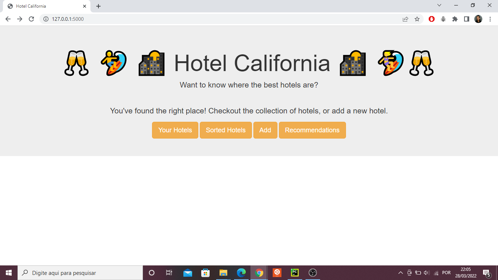

# Hotel California

**Conteúdo da Disciplina**: Divide and Conquer 

## Alunos

|Matrícula | Aluno |
| ----------- | ------------------------------|
| 17/0034992  |  Gustavo Afonso Pires Severo  |
| 17/0011119  |  Geraldo Victor Alves Barbosa |

## Sobre
O projeto se trata de um site que lista hotéis para viajantes e usa algoritmos de D&C para suas funcionalidades, o merge sort para ordenar os heteis e o inversion count para 
sugerir uma lista de recomendação de hotéis, como foi exposto a possibilidade em uma das aulas. 

## Screenshots
.

.

.

## Sobre 
**Linguagem**: Python3 
**Framework**: Flask + bootstrap 

## Instalação
- Instale as dependências listadas no arquivo de requirements.
- Rode o flask, isso pode variar de acordo com o sistema operacional, sendo assim sugiro a [Documentação Oficial](https://flask.palletsprojects.com/en/2.0.x/quickstart/#a-minimal-application)

## Uso 
Rode o projeto e acesse o local host.
Todas as funcionalidades se dão por meio da navegação pelo site usando os botões e formulários.
Caso queira modificar manualmente os dados dos hotéis eles estão disponíveis na pasta critiques e no arquivo hotel-data.csv
